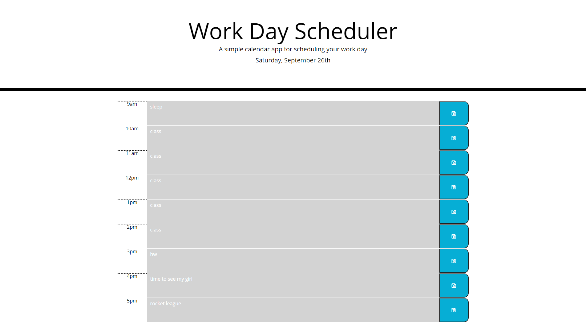

# Day Planner

In this project i was able to create a day planner with multiple features like color coded past present and future segments for each hour between 9-5 and was abe to save your text content using a save feature that saved your text to your local storage so that youll never have to worry about losing your plan for he day even when you close the tab

## Image of the Website

## Built With

* [HTML](https://developer.mozilla.org/en-US/docs/Web/HTML)
* [BOOTSTRAP](https://getbootstrap.com/)
* [JQUERY](https://jquery.com/)
* [CSS](https://developer.mozilla.org/en-US/docs/Web/CSS/Reference)
* [MOMENT](https://momentjs.com/)

## Code Snippet
   Down below you can view the code i used to create each row for each hour insiade the day planner, with the creation of one row i was able to copy it and use it for all the rows just changing the values and ID for each hour between 9am-5pm 

    

          
9am

          <textarea class="col-md-10 textarea" id="9am" value="9"></textarea>
          <button class="col-md-1 saveBtn" id="save" value="9am" data-name="9amtext"><i class="far fa-save"></i></button>
      

## DEPLOYED WEBSITE LINKS

* [Day Planner Website](https://gabrielpineda808.github.io/day-planner/)
* [Day Planner Gitub Repo](https://github.com/GabrielPineda808/day-planner/)

## Authors

* **Gabriel Pineda** 

- [Link to Github](https://github.com/GabrielPineda808)
- [Link to LinkedIn](https://www.linkedin.com/in/gabriel-pineda-a94535195/)